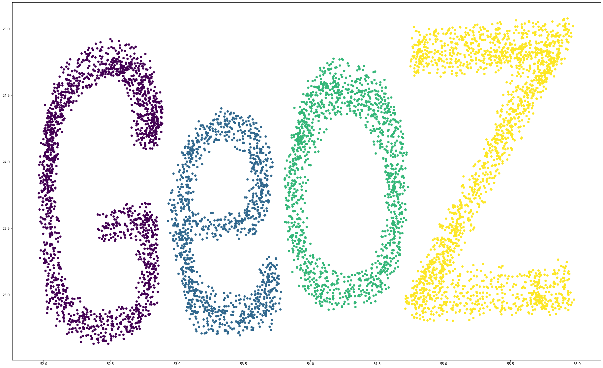
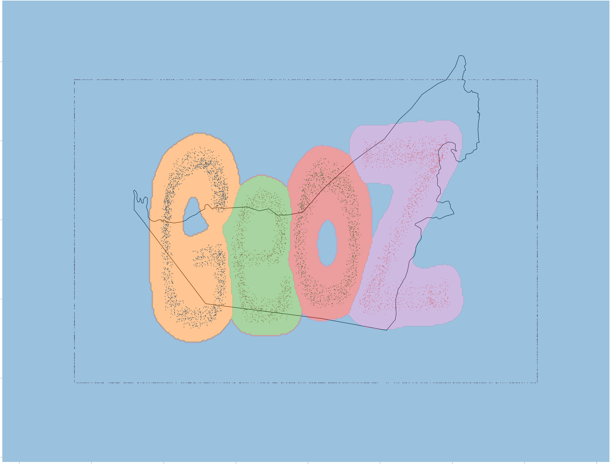
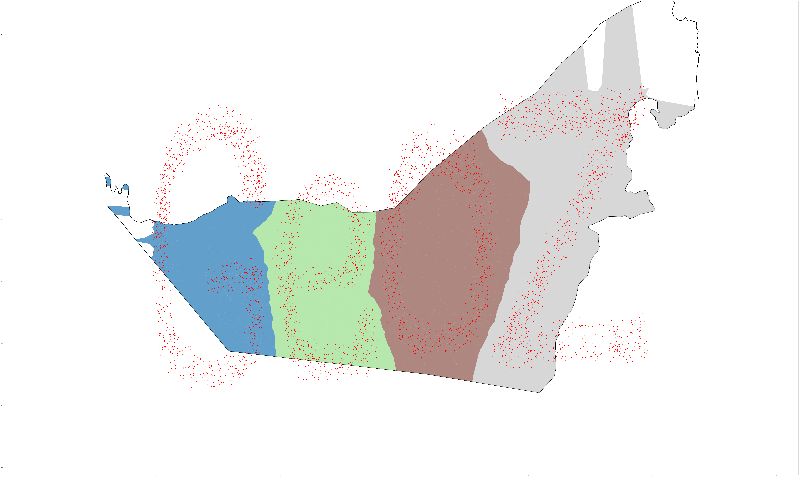

   [](https://pepy.tech/project/geoz) [](https://zenodo.org/badge/latestdoi/577691777)

<div align="center">
  
    <h1>Geographic Decision Zones (GeoZ)</h1>
</div>


GeoZ is a Python library integrating several methods and machine learning modules to create Geographic Maps based on the output of Unsupervised Machine Learning techniques. The library is geared mainly toward delineating the output from Clustering algorithms, but it can be used for other Machine Learning algorithms. GeoZ is distributed under the 3-Clause BSD license.

## Installation

**To install GeoZ using `pip`:**
```bash
pip install geoz
```
## Usage Details

The library has matured substantially since the early release in 2022, but it is still under development. As such, the user will have to provide the data in a certain format as the library is working with a fixed structure and wont fix or tolerate any deviation from the expected format.

### Dataset shape and format Example
The data provided needs to have two variables, one containing the latitude and longitude (eg. latlong) and another variable that contains the predicted classes of the the points (eg. y_pred). please check the below table for illustration:

| LATITUDE 	| LONGITUDE 	| y_pred 	|
|:--------:	|:---------:	|:------:	|
|    30    	|    -104   	|    2   	|
|    32    	|    -103   	|    1   	|
|    35    	|    -105   	|    2   	|
|    33    	|    -104   	|    2   	|
|    35    	|    -102   	|    3   	|

~Please make sure to write (LATITUDE, LONGITUDE) in CAPITAL LETTER, otherwise the algorithm will fail.~  
The algorithm has been enhanced to follow GIS conventions using positional indexing. It now expects **latitude** data in the first column and **longitude** data in the second column, **regardless of the column headers names**. Please note that adhering to this order is crucial; reversing it will lead to inaccurate results.

### Code Example

The examples illustrated here are used to demonstrate how each method plots the data. There are several examples and detailed implementations in the accompanying jupyter notebooks mentioned below. The user is advised to read them for greater details. 

In all the examples shown we use a synthetic dataset called "GeoZD" that was generated using the awesome [drawdata](https://github.com/koaning/drawdata) library, as well as a simplified map of United Arab Emirates (UAE) for demonstration (both displayed below).  
  
  
<div align="center">
  <table>
    <tr>
      <td align="center">
        
        <br>
        <em>Points Distribution</em>
      </td>
      <td align="center">
        
        <br>
        <em>UAE Shapefile</em>
      </td>
    </tr>
  </table>
</div>
  
In the below examples, we import geoz and then load the synthetically generated dataset into a variable named "latlong". The variable should contain the latitude, longitude and the y_pred, but it can also contain only the latitude and longitude without the class. In that case you will need to provide another variable (eg. y_pred) to store the class predictions and use it in the functions calling.  
  
```python
import geoz
import pandas as pd
import geopandas as gpd
import matplotlib.pyplot as plt

state = r'\miscellaneous\shapefile\UAE Simplified.shp'
latlong = pd.read_csv('GeoZD.csv')                      # This is supposed to be the dataset that you have, it must contain the Latitude and the longitude as well as the class information, check the accompanying "GeoZD.cvs" file for further details.

# This part of the code will create a basemap so the mapping functions will draw ontop of it.
stateFile = gpd.read_file(state)
stateFile=stateFile.to_crs("EPSG:4326")
stategeo = stateFile.geometry.union_all(method='unary')
stateplot=stateFile.plot( color='none',  edgecolor='black',linewidth=5)
```

#### convex_hull Function

```python
map1 = geoz.convex_hull_plot(latlong[['y','x']], latlong['label'])              # This Function will return a Convex Hull map of the classes

stateplot = stateFile.plot( color='none',  edgecolor='black',linewidth=5, ax=map1)  # This line will create a basemap ontop of the mapping function results.
```

For further details, the user can refer to the <a href="https://github.com/Ne-oL/geoz/blob/main/miscellaneous/Notebooks/Convex_hull.ipynb">Convex_hull.ipynb</a>

#### sklearn_plot Function

```python
stateplot=stateFile.plot( color='none',  edgecolor='black',linewidth=5) # This line will create a basemap so the mapping function will draw ontop of it.

map2 = geoz.sklearn_plot(latlong[['y','x']], latlong[['label']], C=1000, gamma=50.0, grid_resolution=100,show_points=True, bazel=True, ax=stateplot)                # This Function will return a map drawn using Scikit-Learn "DecisionBoundaryDisplay"
```

For further details, the user can refer to the <a href="https://github.com/Ne-oL/geoz/blob/main/miscellaneous/Notebooks/Sklearn_plot.ipynb">Sklearn_plot.ipynb</a>

#### mlx_plot Function

```python
stateplot=stateFile.plot( color='none',  edgecolor='black',linewidth=5) # This line will create a basemap so the mapping function will draw ontop of it.


map3 = geoz.mlx_plot(latlong[['y','x']], latlong[['label']], bazel=True, ax=stateplot, n_jobs=-1)                    # This Function will return a map drawn using MLextend  "decision_regions"
```

For further details, the user can refer to the <a href="https://github.com/Ne-oL/geoz/blob/main/miscellaneous/Notebooks/Mlx_plot.ipynb">Mlx_plot Notebook</a>

#### voronoi_regions_plot Function
This new function was developed to address one of the main weaknesses in GeoZ library, which was its inadequacy to map small datasets. The function was developed based on the work done in Fang et al., 2024 (https://doi.org/10.1016/j.ejrh.2024.101938), if you use this function please cite them along with GeoZ please. The function works simply by creating voronoi diagrams and then color the regions for each class with the same color, resulting in different regions highlighting the different clusters. 

```python
stateplot=stateFile.plot( color='none',  edgecolor='black',linewidth=5) # This line will create a basemap so the mapping function will draw ontop of it.

map4 = geoz.voronoi_regions_plot(latlong, 'x', 'y', 'label', show_points=True, ax= stateplot, mask=stategeo)                    # This Function will return a map drawn using the new method based on Voronoi diagram "voronoi_regions_plot"
```

For further details, the user can refer to the <a href="https://github.com/Ne-oL/geoz/blob/main/miscellaneous/Notebooks/Voronoi_regions_plot.ipynb">Voronoi_regions_plot.ipynb</a>, <a href="https://github.com/Ne-oL/geoz/blob/main/miscellaneous/Notebooks/Voronoi_regions_plot_Minimum.ipynb">Voronoi_regions_plot_Minimum.ipynb</a> Notebooks. <br><br>
    
For further infromation or the functions other parameters, please check the accompanying [Jupyter Notebooks](https://github.com/Ne-oL/geoz/tree/main/miscellaneous/Notebooks) as well as functions DocStrings as they contain more details and information.

## License information

See the file ([LICENSE](https://github.com/Ne-oL/geoz/blob/main/LICENSE)) for information on the terms & conditions for usage, and a DISCLAIMER OF ALL WARRANTIES.

## Contact

You can ask me any questions via my Twitter Account [Ne-oL](https://twitter.com/Ne_oL). and in case you encountered any bugs, please create an issue in [GitHub's issue tracker](https://github.com/Ne-oL/geoz/issues) and I will try my best to address it as soon as possible. 

## Citation
If you use GeoZ as part of your workflow in a scientific publication, please consider citing GeoZ with the following DOI:


```
@article{ElHaj2023,
author = {ElHaj, Khalid and Alshamsi, Dalal and Aldahan, Ala},
doi = {10.1007/s41651-023-00146-0},
issn = {2509-8829},
journal = {Journal of Geovisualization and Spatial Analysis},
number = {1},
pages = {15},
title = {{GeoZ: a Region-Based Visualization of Clustering Algorithms}},
url = {https://doi.org/10.1007/s41651-023-00146-0},
volume = {7},
year = {2023}
}
```

If you use the new **voronoi_regions_plot** function as part of your workflow in a scientific publication, please consider citing the following work in addition to GeoZ:


```
@article{FANG2024101938,
author = {Jinzhu Fang and Yibo Yang and Peng Yi and Ling Xiong and Jijie Shen and A. Ahmed and K. ElHaj and D. Alshamsi and A. Murad and S. Hussein and A. Aldahan}
title = {Geospatial stable isotopes signatures of groundwater in United Arab Emirates using machine learning},
journal = {Journal of Hydrology: Regional Studies},
volume = {55},
pages = {101938},
year = {2024},
issn = {2214-5818},
doi = {https://doi.org/10.1016/j.ejrh.2024.101938},
url = {https://www.sciencedirect.com/science/article/pii/S2214581824002878},
}
```

- Khalid ElHaj, Dalal Alshamsi, and Ala Aldahan. 2023. “GeoZ: A Region-Based Visualization of Clustering Algorithms.” Journal of Geovisualization and Spatial Analysis 7 (1): 15. https://doi.org/10.1007/s41651-023-00146-0.
- Fang, J.; Yang, Y.; Yi, P.; Xiong, L.; Shen, J.; Ahmed, A.; ElHaj, K.; Alshamsi, D.; Murad, A.; Hussein, S.; et al. Geospatial Stable Isotopes Signatures of Groundwater in United Arab Emirates Using Machine Learning. J. Hydrol. Reg. Stud. 2024, 55, 101938, https://doi.org/10.1016/j.ejrh.2024.101938.
